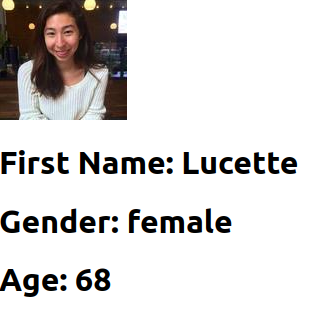

# react-random-user-generator

A Random User Generator using React 

# Fork the project and give it a star if you like it 

**Running Locally in your System:**

## 1 Run git clone repository name
## 2 Run cd Random-User-Generator
## 3 Run npm install
## 4 Run npm start

# You are good to go Happy Hacking

# Features Coming up is adding the contact card in with the portfolio for each user .
